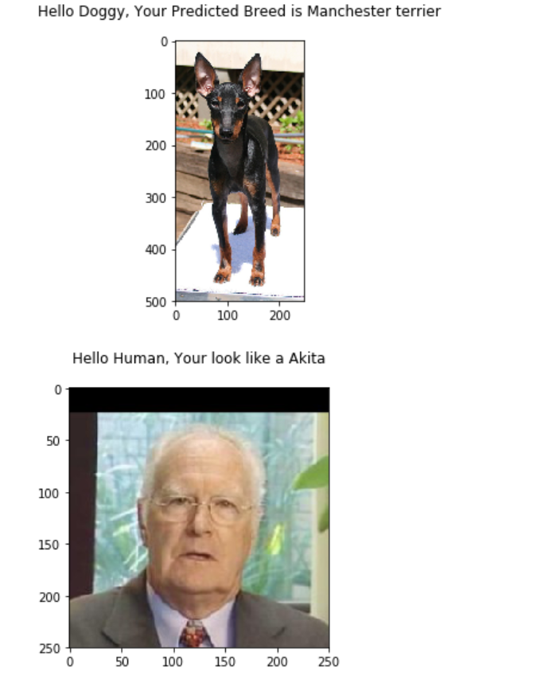

## Dog-Breed-Classifier
This project is a solution to the deep-learning nano degree, dog-breed-classifier project.

### Info

Given an image the Haar Cascade algorithm detects if the provided image is an image of a human. 

When a Human is detected the CNN outputs the a similar dog breed which resembles the human. 

When the image provided is not a human as classified by the HAAR Cascade algorithm, the CNN classifies the dog breed.

The project uses Open CV cascade classifier to detect human faces.

A CNN using Pytorch library is created and achieves an test accuracy of 18% by training for 35 epochs. 

In the later part, using transfer learning, reutilizing the trained Convolutional layes of VGG16 model and replacing the last Fully Connected layers, the test accuracy rises up to 77%.
 
Sample detection 

### Resources
Link to udacity dog-breed-classifier repository can be found [here.](https://github.com/udacity/deep-learning-v2-pytorch)

## Project Instructions

### Instructions

1. Clone the repository and navigate to the downloaded folder.
	
	```	
		git clone https://github.com/udacity/deep-learning-v2-pytorch.git
		cd deep-learning-v2-pytorch/project-dog-classification
	```
    
__NOTE:__ if you are using the Udacity workspace, you *DO NOT* need to re-download the datasets in steps 2 and 3 - they can be found in the `/data` folder as noted within the workspace Jupyter notebook.

2. Download the [dog dataset](https://s3-us-west-1.amazonaws.com/udacity-aind/dog-project/dogImages.zip).  Unzip the folder and place it in the repo, at location `path/to/dog-project/dogImages`.  The `dogImages/` folder should contain 133 folders, each corresponding to a different dog breed.
3. Download the [human dataset](http://vis-www.cs.umass.edu/lfw/lfw.tgz).  Unzip the folder and place it in the repo, at location `path/to/dog-project/lfw`.  If you are using a Windows machine, you are encouraged to use [7zip](http://www.7-zip.org/) to extract the folder. 
4. Make sure you have already installed the necessary Python packages according to the README in the program repository.
5. Open a terminal window and navigate to the project folder. Open the notebook and follow the instructions.
	
	```
		jupyter notebook dog_app.ipynb
	```


